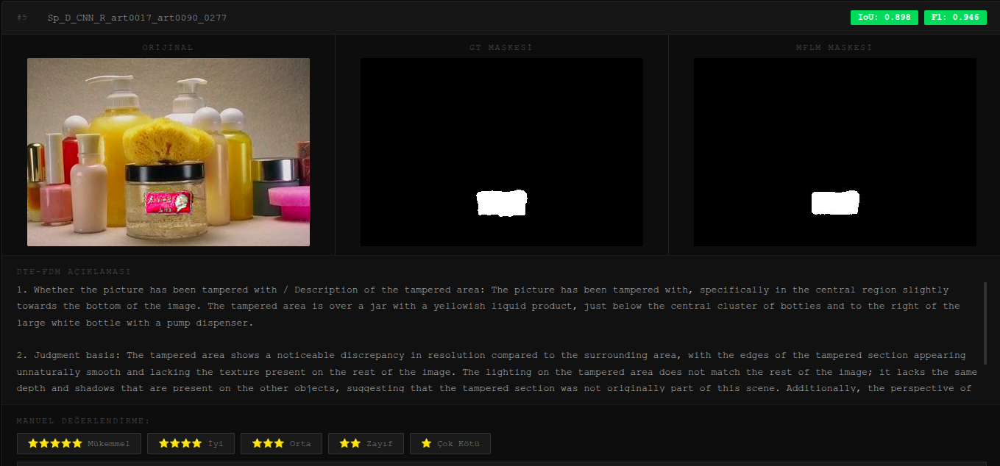

# FakeShield Evaluation Toolkit

FakeShield (ICLR 2025) modelinin görüntü sahteciliği tespiti (image forgery detection, localization & explanation) performansını değerlendirmek için geliştirilmiş otomasyon, metrik hesaplama ve manuel değerlendirme araçları.

Bu repo [orijinal FakeShield reposu](https://github.com/zhipeixu/FakeShield) üzerine inşa edilmiş bağımsız bir değerlendirme katmanıdır — framework kodu değil, ona ait pipeline otomasyonu, IoU/metrik hesaplama ve interaktif sonuç görselleştirme araçlarını içerir.

## Model

**FakeShield-v1-22B**, iki bileşenden oluşan çok modlu bir sahtecilik tespit modelidir:
- **DTE-FDM** (Domain Tag-guided Explainable Forgery Detection Module) — LLaVA tabanlı, görüntünün sahte olup olmadığını doğal dilde gerekçelendirerek açıklayan modül (ışıklandırma, kenar, gölge, perspektif gibi kanıtlara atıfla)
- **MFLM** (Multimodal Forgery Localization Module) — SAM (Segment Anything, ViT-H) tabanlı, sahte bölgeyi piksel düzeyinde maskeleyen segmentasyon modülü

## Veri Setleri

Değerlendirme aşağıdaki veri setleri üzerinde yapılmıştır:
- **CASIA v1.0 / CASIA (Kaggle)** — splicing ve copy-move sahtecilik tespiti için standart benchmark
- **Saakshi test seti** — ek doğrulama seti
- **TID4333** — özel/genişletilmiş test seti

*(Not: Dataset dosyalarının kendisi lisans/boyut nedeniyle bu repoda yer almaz; orijinal kaynaklarından temin edilmelidir.)*

## İçerik
- `run_fakeshield.sh` — Docker tabanlı DTE-FDM + MFLM pipeline çalıştırma otomasyonu (tekli, batch, CSV çıktı modları)
- `run_mflm_batch.sh` — MFLM için toplu segmentasyon çalıştırma
- `evaluate_fakeshield.py` — Model çıktılarının otomatik değerlendirilmesi
- `evaluate_iou.py` — Segmentasyon maskeleri için IoU metrik hesaplama
- `generate_viewer.py` — Sonuçları interaktif HTML üzerinde görselleştiren ve manuel puanlamaya açan araç
- `playground/eval_jsonl.py` — JSONL formatındaki test/çıktı dosyalarını değerlendirme
- `results_sample/` — Örnek çıktı formatları (JSONL)

## Manuel Değerlendirme Arayüzü

`generate_viewer.py`, model çıktılarını (görüntü + tahmin edilen maske + DTE-FDM'in doğal dil gerekçesi) tek bir HTML sayfasında birleştirip, her örnek için 5 yıldızlı manuel puanlama (Mükemmel → Çok Kötü) ve not ekleme imkanı sunar. Değerlendirme tamamlandığında sonuçlar JSON olarak dışa aktarılabilir.

## Kurulum
\`\`\`bash
export FAKESHIELD_DIR=/path/to/your/FakeShield
bash fakeshield_setup.sh
\`\`\`

## Bulgular
FakeShield, splicing tespitinde güçlü performans gösterirken inpainting/object-removal ve AI-generated içerik tespitinde belirgin zayıflık sergiledi.

FakeShield-v1-22B, farklı sahtecilik türlerinde belirgin performans farklılıkları göstermektedir:

| Veri Seti | Sahtecilik Türü | Örnek Sayısı | Accuracy | Precision | Recall | F1 |
|---|---|---|---|---|---|---|
| CASIA | Splicing / Copy-move | 100 | %89.0 | %82.0 | %100 | 0.901 |
| Saakshi Deepfake Detection v3 | AI-generated / Deepfake yüz | 53 | %24.5 | %23.1 | %100 | 0.375 |

**Temel gözlemler:**
- Geleneksel splicing sahteciliğinde (CASIA) model güçlü ve dengeli bir performans sergiliyor (F1 = 0.901).
- AI-generated/deepfake içerikte performans ciddi şekilde düşüyor (F1 = 0.375) — model, gerçek (authentic) görüntülerin büyük bir kısmını da "sahte" olarak işaretliyor (Saakshi setinde 41 gerçek görüntüden yalnızca 1'i doğru sınıflandırılmış).
- Her iki veri setinde de recall %100 olması, modelin "kaçırma" (false negative) yapmadığını, ancak özellikle AI-generated içerikte aşırı temkinli/yanlış-pozitif eğilimli olduğunu gösteriyor.
- Bu sonuçlar, FakeShield'in eğitim dağılımının geleneksel piksel-düzeyi manipülasyonlara (splicing, copy-move) daha yakın olduğunu, modern generative AI çıktılarını ayırt etmede ise yetersiz kaldığını düşündürmektedir.

*(Metrikler `evaluate_fakeshield.py` ve `evaluate_iou.py` ile hesaplanmıştır; ham sonuçlar `results_sample/` içindeki JSONL dosyalarında örneklenmiştir.)*

## Lisans
Bu repo yalnızca değerlendirme/otomasyon kodunu içerir. Orijinal FakeShield modeli ve ağırlıkları için [orijinal repo](https://github.com/zhipeixu/FakeShield) ve lisansına bakınız.
